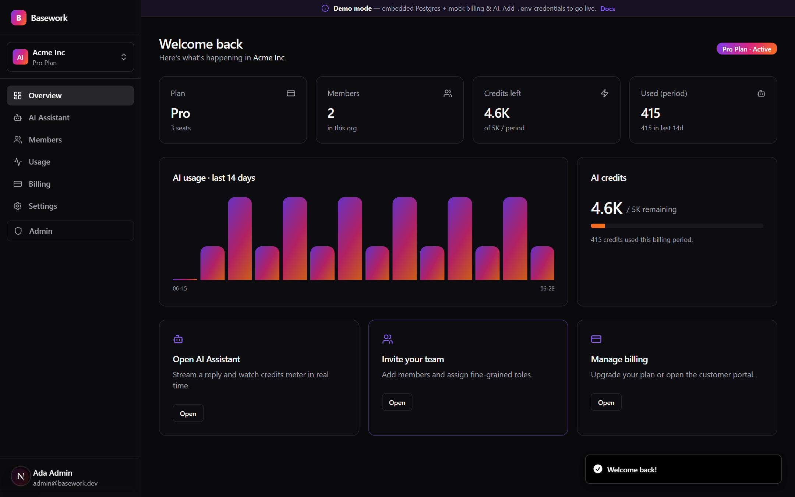
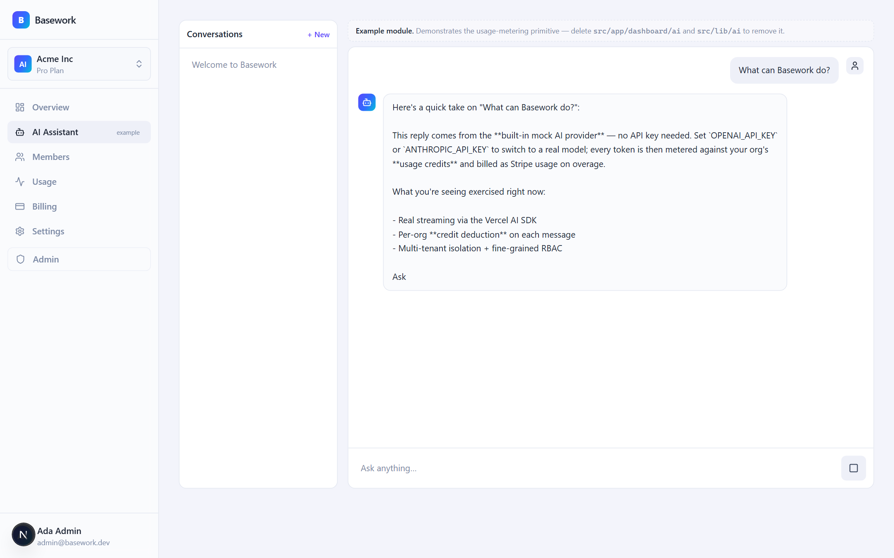
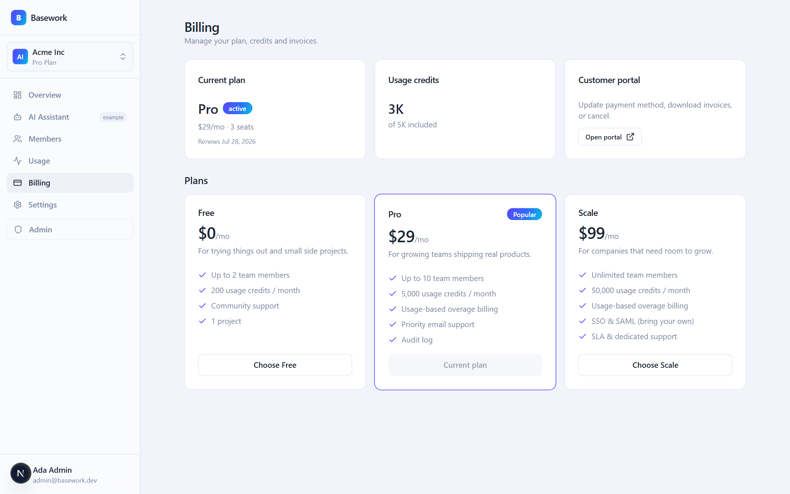
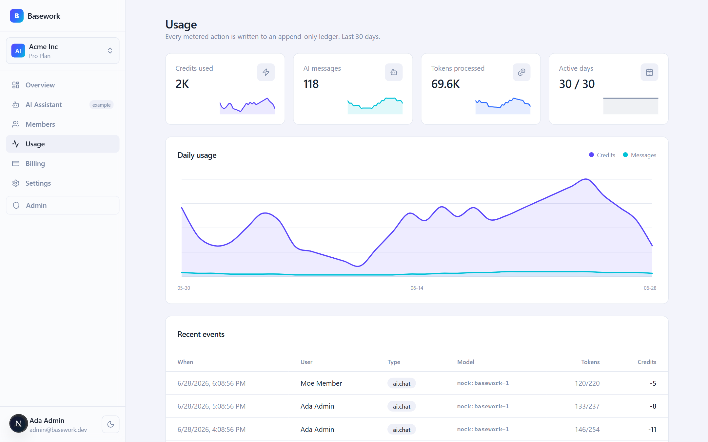
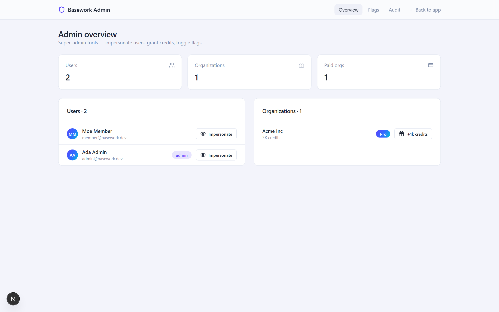

<div align="center">

# Basework

### The complete, multi-tenant SaaS template — you bring the product.

Auth · Organizations & fine-grained RBAC · Stripe billing · **usage-based metering** · admin panel with impersonation · audit logs · durable jobs — every functionality your SaaS needs, so you just build the product. **Runs with zero configuration.**

[](https://github.com/fizzexual/BaseworkSaaS/actions/workflows/ci.yml)
[](./LICENSE)


<br/>



</div>

---

## Why Basework?

Basework isn't tied to one product idea — it's the **complete foundation** every SaaS needs. You bring the product (a CRM, an analytics tool, a dev platform, an AI app — anything); it brings everything around it, and you delete the parts you don't use.

- 📊 **Usage-based metering & billing.** Meter any action — API calls, exports, AI tokens — as per-org **credits**, enforce plan limits, and report overage to Stripe. The included AI assistant is just one example consumer. Almost no template ships this.
- 🏢 **Real multi-tenancy.** Organizations, members, invitations, and a **fine-grained permission policy** (not bare role strings). Tenant isolation is covered by tests.
- 💳 **Billing done right.** Checkout → **signature-verified webhook → database** sync, customer portal, plan changes that reset credits. The "everyone fakes it" part is real and tested.
- 🛡️ **Admin panel with secure impersonation**, feature flags, and an immutable **audit log**.
- ⚡ **Zero-config dev.** `pnpm dev` boots a fully seeded demo with **no accounts and no keys** — embedded Postgres (PGlite), plus mock email / billing / AI providers. Flip to production by filling `.env`.
- ✅ **Genuinely tested.** Typecheck, lint, unit + integration (in-memory Postgres), and Playwright E2E — all in CI with no external services.

> **The 30-second pitch:** clone it, run `pnpm dev`, and you have a multi-tenant dashboard with working billing, usage metering, an admin panel, and a streaming AI *example* — before you've created a single account anywhere. Then delete what you don't need and build your product.

## Quickstart

```bash
git clone https://github.com/fizzexual/BaseworkSaaS.git
cd BaseworkSaaS
pnpm install
pnpm dev
```

Open **http://localhost:3000** and sign in with the seeded demo accounts:

| Account | Email | Password | Role |
| --- | --- | --- | --- |
| Owner / super-admin | `admin@basework.dev` | `password123` | owner + admin |
| Member | `member@basework.dev` | `password123` | member |

No `.env`, no database, no Stripe account, no API keys. It just runs.

## Screenshots

| AI assistant (streamed + metered) | Billing & plans |
| --- | --- |
|  |  |

| Usage ledger | Admin panel |
| --- | --- |
|  |  |

## Stack

| Layer | Choice |
| --- | --- |
| Framework | **Next.js 16** (App Router, RSC, Server Actions), React 19, TypeScript (strict) |
| UI | Tailwind CSS v4, Radix primitives, a token-driven design system with light & dark themes |
| Database | **Drizzle ORM** — embedded **PGlite** in dev ↔ **Postgres / Neon** in prod |
| Auth | **Better Auth** — email+password, OAuth, organizations, admin + impersonation |
| Billing | **Stripe** (subscriptions + usage metering) behind a provider interface, with a mock provider for zero-config |
| AI | **Vercel AI SDK** — streaming chat, credit metering, bring-your-own keys; mock provider when no key |
| Infra | durable job queue, feature flags, per-plan rate limiting, structured logging, audit log, React Email + Resend |
| Tooling | Biome, Vitest, Playwright, GitHub Actions |

## How it works

Basework has **two modes**, chosen automatically from the environment:

```
DATABASE_URL empty   → embedded PGlite (Postgres in-process)   |  set it → Postgres / Neon
STRIPE_SECRET_KEY    → mock billing (simulated checkout)        |  set it → real Stripe
OPENAI/ANTHROPIC key → mock AI (deterministic streaming)        |  set it → real LLM
RESEND_API_KEY empty → console email transport                  |  set it → Resend
```

The credit-metering flow is the heart of it:

```
chat request → check org credit balance / plan overage policy
            → stream the model response (Vercel AI SDK)
            → on finish: count tokens → deduct credits (atomic, ledgered)
            → report overage to Stripe as a metered usage event
```

## Theming & layout

Every component is built on semantic design tokens (`bg-card`, `text-foreground`, `bg-brand`, …) defined once in [`src/app/globals.css`](src/app/globals.css) — so the whole app re-skins from one file. Two switches ship out of the box:

- **Light / dark mode** — a persisted toggle (next-themes) in the sidebar and marketing header. The `.dark` class overrides the palette vars via `@theme inline`; no per-component changes.
- **Nav layout** — a left sidebar rail or a horizontal top bar. Seed the default with `NEXT_PUBLIC_NAV_LAYOUT=topnav`, or flip it live from the admin panel (below).

## Superadmin controls

A super-admin (global `admin` role or a `SUPER_ADMIN_EMAILS` address) configures the whole app at runtime from **`/admin/settings`** — no redeploy:

- **Appearance** — nav layout, default theme, brand name, and accent color, applied app-wide and live.
- **Feature modules** — switch AI, Billing, Members, or Usage off; a disabled module disappears from the nav, its pages redirect, and its API route / server actions reject (enforced server-side, not just in the UI).
- **Access** — close sign-ups (invite-only mode — unexpired invitations still work) or flip on maintenance mode, which locks the app for non-admins in both the UI and at the mutation boundary.

Settings persist in a `platform_settings` singleton row; module on/off rides the existing feature-flags table. The env flags seed the initial defaults, and the stored values override them once set — so it still boots zero-config.

## Going to production

1. Copy `.env.example` to `.env` and fill the values.
2. Provision Postgres (e.g. [Neon](https://neon.tech)) and set `DATABASE_URL`.
3. `pnpm db:migrate` to apply migrations.
4. Create Stripe products/prices (`pnpm stripe:sync`) and set `STRIPE_*`.
5. Set `BETTER_AUTH_SECRET`, `ENCRYPTION_KEY`, and an LLM key.
6. Deploy. Point a cron at `POST /api/jobs/tick` to drain the job queue.

Run `pnpm doctor` anytime to see which mode each subsystem is in.

## Project structure

```
src/
  app/
    (marketing)/         # landing + pricing
    (auth)/              # sign-in / sign-up / accept-invitation
    dashboard/           # app shell: overview, ai, members, usage, billing, settings
    admin/               # super-admin: platform settings, users, flags, audit
    api/                 # better-auth, stripe webhook, ai chat, jobs
  lib/
    auth/ db/ billing/ ai/ rbac/ email/ jobs/ flags/ modules/ settings/ ratelimit/ observability/ env
  server/                # request context + server actions
drizzle/                 # schema migrations
tests/                   # vitest (unit + integration) and playwright (e2e)
```

## Scripts

| Command | Description |
| --- | --- |
| `pnpm dev` | Run the app (zero-config) |
| `pnpm build` / `pnpm start` | Production build / serve |
| `pnpm typecheck` | `tsc --noEmit` |
| `pnpm lint` / `pnpm lint:fix` | Biome check / autofix |
| `pnpm test` | Vitest (in-memory Postgres) |
| `pnpm test:e2e` | Playwright end-to-end |
| `pnpm db:generate` / `pnpm db:migrate` | Drizzle migrations |
| `pnpm stripe:sync` | Create Stripe products/prices/meters |
| `pnpm doctor` | Print the active runtime modes |

## How it compares

| | **Basework** | Typical boilerplate |
| --- | :---: | :---: |
| Usage-based **metering & credits** | ✅ | ❌ |
| Multi-tenant orgs + **fine-grained RBAC** | ✅ | partial |
| Admin **impersonation** | ✅ | ❌ |
| **Tested** Stripe webhook sync | ✅ | ❌ |
| **Zero-config** runnable demo | ✅ | ❌ |
| Audit log + durable jobs | ✅ | rare |
| 100% open source (MIT) | ✅ | varies |

## Contributing

Contributions are welcome — see [CONTRIBUTING.md](./CONTRIBUTING.md). Please keep
`pnpm typecheck`, `pnpm lint`, `pnpm test`, and `pnpm build` green.

## License

[MIT](./LICENSE) — use it for anything, including commercial products.
